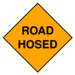

#+title: Road Hosed
#+header: :file (concat (file-name-base) ".svg")
#+header: :tangle (concat (file-name-base) ".gv")
#+begin_src dot
  graph {
      roadhosed [label="ROAD\nHOSED", shape=square, orientation=45, style=filled, fillcolor=orange, color=black, fontcolor=black, fontname="Helvetica-Bold", fixedsize=true, width=1.2, height=1.2];
  }
#+end_src

#+RESULTS:

